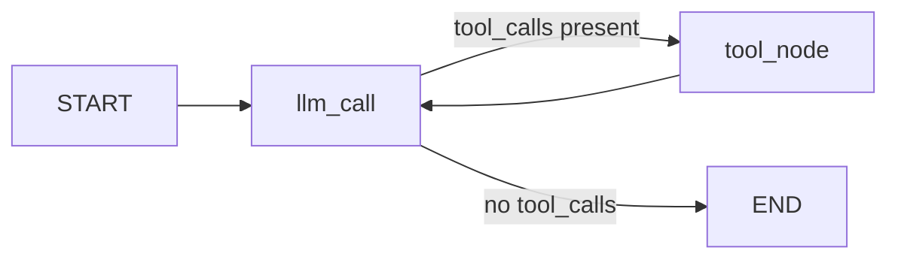

# Day 0 — Setup Summary

> **The plan is live. Stack is confirmed. First agent shipped.**

| Field | Value |
|---|---|
| Date | Sunday, May 10, 2026 |
| Phase | Pre-week setup |
| Target hours | ~5 focused setup hours |
| Status | ✅ Complete — ahead of schedule |

---

## Table of contents

- [What got done](#what-got-done)
- [What carries forward](#what-carries-forward)
- [Agent built today](#agent-built-today)
- [Stack verification](#stack-verification)
- [Tomorrow — Monday May 11](#tomorrow--monday-may-11)
- [Honest feedback](#honest-feedback)

---

## What got done

### Block 1 — Core setup (7:00–9:00 AM)
- [x] Woke at 4:00 AM — first successful execution of new daily clock
- [x] Workout completed (full body + elliptical)
- [x] Breakfast — egg scramble (3 eggs), 2 dosa, chutney
- [x] **Anki** — desktop + mobile installed, 75 math vocab cards imported, synced across devices
- [x] **GitHub** — `ml-journey-2026` and `langgraph-dishes` repos created, cloned, initial structure pushed
- [x] **Python environments** — `ml-env` and `agentic-env` created with `requirements.txt` for each; all dependencies installed clean on Python 3.12
- [x] **Browser bookmarks** — ML Plan folder with 12 links set up

### Block 2 — Infrastructure + planning (9:00 AM–12:30 PM)
- [x] **OpenAI API** — key configured, $5 credit loaded
- [x] **Langfuse** — account created, project set up, keys wired into `.env`
- [x] **Stack verification** — LangGraph + OpenAI + Langfuse all confirmed working in single script
- [x] **Google Calendar** — all recurring blocks added through November 9, 2026; permanent blocks (sleep, exercise, breakfast) set to never end
- [x] **V6 roadmap** — summarized, phase exits and risk register internalized

### Block 3 — LangGraph dry run (1:30–4:30 PM)
- [x] **LangGraph Quickstart** — typed along, built working chatbot graph
- [x] **ReAct agent** — built from scratch with 4 arithmetic tools (add, subtract, multiply, divide)
- [x] **Conditional edges** — `should_continue` routing tool call vs END working correctly
- [x] **Tool loop** — `tool_node → llm_call` cycle working, LLM summarizing tool results correctly
- [x] **Modification** — added `subtract` tool unprompted, updated tool registry and system prompt
- [x] **Code pushed** — committed to `langgraph-dishes` under `dry-run/`

---

## What carries forward

These were intentionally deferred — not missed:

| Item | Deferred to |
|---|---|
| Workflows + agents doc | Friday May 15 (week 1 LangGraph block) |
| Persistence / Memory (`MemorySaver`, `thread_id`) | Friday May 15 (week 1 LangGraph block) |
| Personal blog domain | Week 18 |
| LinkedIn profile polish | Week 18 |
| Fine-tuning environment | Phase 3 |

> **Note**
> Nothing above is a gap. Every deferral was deliberate and matches the v6 roadmap schedule exactly.

---

## Agent built today

The agent correctly:
- Routes arithmetic queries to the right tool
- Loops back for multi-step reasoning if needed
- Summarizes tool output naturally in final response

**Test runs passed:**
- `"Add 3 and 10"` → called `add(3, 10)` → returned 13 ✅
- `"What is 144 divided by 12?"` → called `divide(144, 12)` → returned 12.0 ✅

---

## Stack verification

| Component | Status | Notes |
|---|---|---|
| Python 3.12 | ✅ | No issues |
| LangGraph | ✅ | Deprecation warning on startup — harmless |
| LangChain OpenAI | ✅ | `gpt-4o-mini` responding correctly |
| Langfuse | ✅ | Traces appearing in dashboard |
| Anki | ✅ | 75 cards synced across desktop + mobile |
| GitHub | ✅ | Both repos live, first commits pushed |
| Google Calendar | ✅ | All blocks through Nov 9, 2026 |

---

## Tomorrow — Monday May 11

**7:00–9:00 AM deep work block:**

- Watch 3B1B Linear Algebra videos 1, 2, 3
- Code `add_vectors()` from scratch in Python lists then NumPy
- Plot two 2D vectors and their sum
- Write a function applying a 2×2 rotation matrix to a unit grid
- Commit + push: `"week 1 day 1 — vector basics + first transformation"`

**Lunch (12:30–1:00 PM):**
- Anki reviews — let the algorithm surface cards, don't force new ones
- Skip podcast day 1

**Evening (8:00–8:30 PM):**
- Plan Tuesday's block
- Set 4 AM alarm
- Sleep by 9 PM

---

## Honest feedback

### What went well

You executed almost everything on a setup checklist that was designed to take a full day, and you finished before the sun went down. The 4 AM wake + workout + breakfast all happened as planned on day zero — which is the hardest day because there's no habit yet, only willpower. That's a real signal.

The LangGraph work was better than expected. Building a working ReAct agent with 4 tools, conditional routing, and a tool loop on the first day of the plan — without it being assigned — shows you're not just following instructions. Adding `subtract` unprompted and catching that the system prompt needed updating was good instinct.

The bug you hit (`message` vs `messages`) was a one-character typo that you debugged and fixed cleanly. That's the job.

### What to watch

**The sonic hedgehog energy is an asset and a liability.** You moved fast today because setup is inherently exciting — new tools, first commits, first working agent, everything clicking. Week 5 won't feel like this. The 4 AM alarm on a Tuesday in June, when the novelty is gone and you're doing eigenvalue exercises for the third morning in a row, is the real test. Today proved you can start. The plan needs you to prove you can sustain.

**You skimmed the v6 plan rather than reading it end to end.** You asked for a summary instead of reading it yourself. That's understandable — it's a long document and the day was full. But the risk register, the exit checklists, and the 9 things that matter most are written to be internalized, not summarized. Read the actual document this week during a lunch slot. The summary I gave you is accurate but it doesn't replace sitting with the full plan once.

**The calendar is blocked but untested.** You've never run a 9:00 AM–7:00 PM office day followed by a 7:00–9:00 AM deep work morning. Tomorrow is the first real data point. If the morning block feels impossible, don't gut it out silently — adjust and tell me.

### The number that matters most this week

Not how many videos you watch or how many commits you push. It's this: **did you average 7+ hours of sleep?** Everything else is downstream of that. If sleep slips, the 4 AM wake slips, the deep work slips, the office day gets harder, and by Friday you're running on fumes. Guard it like the primary metric it is.

> **Bottom line:** Day zero was excellent. The trap after an excellent day zero is thinking the hard part is done. It isn't. The hard part starts Monday at 7 AM and doesn't end for 26 weeks. Today just proved you're capable of it.

Sleep well. 🦔